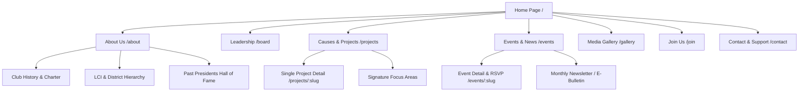

# 🦁 Leo Club Multi-Site Website Framework & Specification

A modern, scalable website blueprint and design specification designed specifically for **Leo Clubs** (Districts, Multiple Districts, and Local Clubs), inspired by the clean, corporate, and youthful aesthetic of the **Lions Clubs International & Leo MD 306** design language.

---

## 🎨 1. Design System & Visual Theme (Based on Shared Reference)

### 1.1 Color Palette
The color scheme blends the prestigious global heritage of Lions International with the youthful dynamism of the Leo movement:

| Color Role | Hex Code | Purpose / Application |
| :--- | :--- | :--- |
| **Primary Navy Blue** | `#003399` / `#0A3B8B` | Brand identity, primary buttons, hero banners, dark cards |
| **Accent Sky/Cyan** | `#00A3E0` / `#00B4D8` | Mini accent bars, hover states, badges, CTA highlights, "My Leo" button |
| **Leo Heritage Gold** | `#F5A800` / `#FFC72C` | Lions/Leo official emblem accent, star ratings, award highlights |
| **Light Card Surface** | `#F4F6F9` / `#F8F9FB` | Secondary cards, subtle contrast backgrounds, feature cards |
| **Pure White** | `#FFFFFF` | Main page canvas, clean contrast cards, text on dark backgrounds |
| **Deep Charcoal** | `#1A1E24` / `#111827` | Headings, primary text, high-contrast readable elements |
| **Muted Slate Gray** | `#5A6578` / `#6B7280` | Subtitles, body paragraphs, meta information |
| **Border & Divider** | `#E5E9F0` / `#E2E8F0` | Stat dividers, card borders, subtle separators |

---

### 1.2 Typography
- **Headings Font**: `Plus Jakarta Sans` or `Outfit` (700 Bold / 800 ExtraBold) — modern geometric sans-serif for impactful headlines.
- **Body Font**: `Inter` (400 Regular / 500 Medium / 600 SemiBold) — clean, highly readable UI text.
- **Accent Labels**: All-caps with `letter-spacing: 0.12em;` and `font-size: 0.75rem - 0.85rem`.

---

### 1.3 Signature UI Elements (Matching Reference)

1. **Category Mini-Accent Bar**:
   - A distinct cyan horizontal pill bar (`width: 36px; height: 4px; background: #00A3E0; border-radius: 2px;`) placed directly above section category labels (e.g., above `WHAT WE ARE PART OF` or `IMPACT`).
2. **Branded Affiliation Cards**:
   - High-radius rounded cards (`border-radius: 20px;`) featuring subtle watermark line illustrations in the background.
   - Card 1: Solid Royal Blue background with white Lions logo and text.
   - Card 2: Light pearl surface with Leo emblem watermark and dark text.
   - Card 3: Deep Navy gradient with local District / Club badge.
3. **Impact Stats Counter Matrix**:
   - Large bold numbers (`font-size: 3.5rem; font-weight: 800; color: #111827;`).
   - Clean 4-quadrant grid split with ultra-thin `#E5E9F0` border lines.
4. **Action Buttons**:
   - Pill-shaped buttons (`border-radius: 9999px;`) with smooth hover translations and icon arrow animations (`→` / `↗`).

---

## 🗺️ 2. Comprehensive Sitemap & Page Hierarchy



---

## 📄 3. Detailed Page Breakdown & Section Structure

---

### PAGE 1: HOME PAGE (`/`)

#### Section 1: Navigation Header (Sticky & Responsive)
- **Left**: Club / District Logo with dual branding (Leo Emblem + Local Club Identity e.g., *"Leos of Sri Lanka & Maldives"* or *"Leo Club of [University/City]"*).
- **Center**: Navigation Links
  - About Us ▾
  - Leadership / Board
  - Our Causes ▾
  - News & Events ▾
  - Resources & Gallery
- **Right**:
  - `My Leo` / `Join Us` Pill Button with external icon (`↗`) or modal trigger.
  - Mobile Hamburger Menu drawer.

#### Section 2: Hero Section (3 High-Impact Variants)
*Choose or customize for different clubs:*

- **Variant A (Split Hero - Modern Youth Service)**:
  - **Left**: Bold headline (*"Empowering Youth. Inspiring Change. Serving Communities."*), subheadline, dual action buttons (`Explore Projects` & `Join Our Club`), and active members count badge.
  - **Right**: Dynamic interactive photo collage / hero image of Leos in action (community service, fellowship, awards).
- **Variant B (Full-Width Cinematic Slider)**:
  - High-resolution hero carousel with overlay gradient, live project highlights, and quick stats ribbon.
- **Variant C (Video Hero)**:
  - Background looping video of club service initiatives with frosted glassmorphism action card.

#### Section 3: "What We Are Part Of" (As seen in Reference)
- **Header**: Cyan accent bar + Subtitle: `WHAT WE ARE PART OF` + Title: `Lions Clubs International`.
- **Right Text**: Short narrative introducing Melvin Jones (1917), 1.4M+ members worldwide, motto *"We Serve"*, and the Leo motto *"Leadership, Experience, Opportunity"*.
- **3-Card Interactive Affiliation Banner**:
  - **Card 1 (Lions International)**: Blue background, Lions emblem, subtitle *"Since 1917. The largest service organization in the world."*, link: `Read the history →`.
  - **Card 2 (Leo Movement)**: Pearl light background, Leo emblem watermark, subtitle *"Leadership. Experience. Opportunity. Since 1957."*.
  - **Card 3 (Multiple District / District / Local Club)**: Deep Navy card with local badge, subtitle *"Led by young leaders passionate about service."*.

#### Section 4: "Impact in Figures" (As seen in Reference)
- **Left Column**:
  - Cyan Accent Mini-Bar
  - Tag: `IMPACT`
  - Headline: `[Club / District Name], in figures`
  - Description: *"Where our dedication stands today across community development, youth empowerment, and humanitarian relief."*
- **Right Column (2x2 Counter Grid)**:
  - `[X]` Active Districts / Zones
  - `[X]+` Chartered Clubs / Members
  - `[X]+` Volunteer Hours Dedicated
  - `[X]+` Completed Projects / Lives Impacted

#### Section 5: Pillars & Focus Areas (Our Causes)
- Interactive tabs / cards for the global service pillars:
  - 🌿 **Environment & Tree Planting**
  - 👁️ **Vision & Health Care**
  - 🍎 **Hunger Relief & Nutrition**
  - 🎗️ **Childhood Cancer Awareness**
  - 💉 **Diabetes Awareness & Screenings**
  - 🎓 **Youth Empowerment, Literacy & Leadership**
  - 🤝 **Disaster Relief & Community Aid**

#### Section 6: Featured Projects / Signature Initiatives
- 3-Column dynamic card grid showcasing recent top projects:
  - Cover photo + Category Tag badge (e.g. `Environment`, `Youth Development`)
  - Project Title & Date
  - Summary paragraph
  - Metrics pill (e.g., `500+ Trees Planted` or `1,200 Meals Served`)
  - `Read Story →` button

#### Section 7: Upcoming Events & Activities Calendar
- Timeline or interactive calendar view of upcoming meetings, service camps, fellowship galas, and district conferences with `Add to Google Calendar` and `RSVP` buttons.

#### Section 8: Testimonials & Member Spotlight
- Card carousel featuring quotes from active Leo members, Leo-Lion advisors, and community beneficiaries sharing their growth and impact.

#### Section 9: Call-To-Action (CTA) Banner
- Dark Navy background with cyan glow accents.
- Title: *"Ready to make a meaningful difference?"*
- Buttons: `Join Our Club Today` & `Partner / Sponsor a Project`.

#### Section 10: Global Footer
- **Col 1**: Club Logo, Sponsoring Lions Club recognition, District info, Social media handles (Instagram, Facebook, LinkedIn, YouTube, TikTok).
- **Col 2**: Quick Links (About, Board, Projects, Charter, Constitution).
- **Col 3**: Resources (Download Constitution, Brand Guidelines, Project Report Forms, Leo Song).
- **Col 4**: Contact Details (Official Email, Meeting Venue, District Secretariat).
- **Bottom Bar**: Copyright © [Year] [Club Name]. Lions Clubs International Affiliated.

---

### PAGE 2: ABOUT US (`/about`)

1. **Hero**: *"Leadership, Experience, Opportunity since [Charter Year]"*.
2. **The Leo Story & History**: How the club was chartered, charter president, growth over the years.
3. **Vision, Mission & Core Values**:
   - **Leadership**: Developing project management, communication, and executive skills.
   - **Experience**: Hands-on social impact and community service.
   - **Opportunity**: Global networking, fellowship, and international conventions.
4. **Organizational Hierarchy**:
   - Interactive tree: Lions Clubs International (LCI) ➔ Multiple District 306 ➔ District ➔ Sponsoring Lions Club ➔ Local Leo Club.
5. **Sponsoring Lions Club Recognition**: Highlighting the mentor Lions Club and guiding Leo-Lion advisors.
6. **Past Presidents & Hall of Fame**: A legacy wall honoring past club presidents and major district/international awards received.

---

### PAGE 3: EXECUTIVE BOARD & LEADERSHIP (`/board`)

1. **Hero**: *"The Leaders Behind the Mission - Executive Committee [2024/2025]"*.
2. **Top Table Officers**:
   - Club President
   - Immediate Past President
   - 1st & 2nd Vice Presidents
   - Club Secretary & Assistant Secretary
   - Club Treasurer & Assistant Treasurer
3. **Directors & Committee Chairs**:
   - Director of Community Service
   - Director of Youth & Leadership
   - Director of Public Relations & Social Media
   - Director of Fellowship & Sports
   - Director of Fund Raising & Partnerships
4. **Card UI Details**:
   - High-quality professional portrait
   - Full Name, Designation, and Profession / University
   - Short leadership motto or bio
   - Direct LinkedIn & Email contact links.
5. **Advisory Panel**:
   - Sponsoring Lion President, Leo Club Advisor, Guiding Lion.

---

### PAGE 4: CAUSES & PROJECTS DIRECTORY (`/projects`)

1. **Hero & Filter Bar**:
   - Filter chips: `All Projects`, `Environment`, `Hunger`, `Vision/Health`, `Youth Empowerment`, `Fellowship`, `Disaster Relief`.
   - Search bar for project keywords.
2. **Project Grid (Paginated / Infinite Scroll)**:
   - Dynamic cards showing:
     - Badge: `Ongoing` or `Completed`
     - Project thumbnail image
     - Impact stats badge (e.g. `200 beneficiaries`)
     - Short summary and read more trigger.
3. **Single Project Template (`/projects/:slug`)**:
   - Hero banner with project photo and full title
   - Project Overview, Objectives, and Scope
   - Impact summary table (Volunteers involved, funds raised, lives impacted)
   - Photo gallery / Lightbox carousel
   - Acknowledgement of sponsors & partners
   - Related projects recommendations.

---

### PAGE 5: NEWS, EVENTS & PUBLICATIONS (`/events`)

1. **Upcoming Events Section**:
   - Date badge (Day / Month)
   - Event Title & Venue (Online / Physical location with Google Maps pin)
   - Registration / RSVP modal
2. **Past Events & Press Releases**:
   - Detailed news writeups of completed activities.
3. **Club Bulletins & Newsletter Downloads**:
   - PDF viewer and download links for quarterly/annual club magazines and project reports.

---

### PAGE 6: MEDIA GALLERY (`/gallery`)

1. **Category Tabs**: `Community Projects`, `Fellowship Trips`, `District Conferences`, `Installations & Awards`.
2. **Masonry Grid Layout**: High-resolution image tiles with zoom-in modal, caption, and download capability.
3. **Video Highlights**: Embedded YouTube / Vimeo reels of installation ceremonies and project documentaries.

---

### PAGE 7: JOIN US / MEMBERSHIP (`/join`)

1. **Hero**: *"Begin Your Leadership Journey with Leo"*.
2. **Why Join Leos (Benefits Grid)**:
   - 🌍 Worldwide Recognition & Certificates
   - 💼 Executive Leadership Training & Public Speaking
   - 🤝 Lifelong Friendships & Global Fellowship
   - ❤️ Creating Direct Tangible Impact in Communities
3. **Eligibility Requirements**:
   - Alpha Leos (Ages 12–18) vs. Omega Leos (Ages 18–30)
   - Membership commitment & expectations
4. **Interactive Membership Form**:
   - Step 1: Personal Details (Name, DOB, Phone, Email, City)
   - Step 2: Occupation / School / University details
   - Step 3: Areas of Interest (Project Management, Design, Public Relations, Volunteering)
   - Step 4: Submission & automated confirmation email.
5. **Membership FAQ Accordion**:
   - Common questions regarding membership fees, time commitment, meeting frequencies, and advisor mentorship.

---

### PAGE 8: CONTACT & SPONSOR US (`/contact`)

1. **Interactive Contact Form**: Inquiries for membership, project collaborations, and sponsorships.
2. **Club Meeting Details**:
   - General Meeting venue & schedule (e.g., *"Every 2nd & 4th Sunday at 4:00 PM"*).
   - Embedded Google Map.
3. **Sponsorship & Donation Options**:
   - Bank transfer details for community service fund
   - In-kind donation guidelines
   - Corporate partnership packages.

---

## ⚙️ 4. Scalable Multi-Club Configuration Schema (`club.config.json`)

To make this template instantly reusable across dozens of Leo Clubs, all club-specific content is driven by a unified JSON configuration file:

```json
{
  "clubInfo": {
    "clubName": "Leo Club of Colombo Millennium",
    "clubId": "LEO-306-00123",
    "district": "District 306 A2",
    "multipleDistrict": "Multiple District 306",
    "country": "Sri Lanka",
    "charterYear": 2012,
    "sponsoringLionsClub": "Lions Club of Colombo Millennium",
    "tagline": "Leadership. Experience. Opportunity.",
    "motto": "We Serve with Passion",
    "logo": "/assets/branding/leo-club-logo.svg",
    "lionLogo": "/assets/branding/lions-logo.svg",
    "districtLogo": "/assets/branding/district-logo.svg"
  },
  "contact": {
    "email": "info@leocolombomillennium.org",
    "phone": "+94 77 123 4567",
    "address": "Colombo, Sri Lanka",
    "socials": {
      "facebook": "https://facebook.com/leocolombo",
      "instagram": "https://instagram.com/leocolombo",
      "linkedin": "https://linkedin.com/company/leocolombo",
      "youtube": "https://youtube.com/@leocolombo"
    },
    "meetingSchedule": "Every 2nd Sunday at 4:00 PM via Zoom / Royal College Hall"
  },
  "impactStats": {
    "activeMembers": 65,
    "completedProjects": 180,
    "volunteerHours": "12,500+",
    "livesImpacted": "45,000+"
  },
  "pillars": [
    { "id": "environment", "name": "Environment & Green Earth", "icon": "leaf" },
    { "id": "hunger", "name": "Hunger Relief", "icon": "utensils" },
    { "id": "youth", "name": "Youth Leadership & Education", "icon": "academic-cap" },
    { "id": "health", "name": "Vision & Diabetes Care", "icon": "heart-pulse" }
  ]
}
```

---

## 💻 5. Ready-to-Use UI Component Code Snippets (Vanilla CSS + HTML)

### 5.1 "What We Are Part Of" Section HTML/CSS

```html
<section class="affiliation-section">
  <div class="container">
    <div class="section-header-split">
      <div class="header-left">
        <div class="cyan-accent-bar"></div>
        <span class="category-label">WHAT WE ARE PART OF</span>
        <h2 class="section-title">Lions Clubs International</h2>
      </div>
      <div class="header-right">
        <p class="section-desc">
          Lions Clubs International (LCI), founded by Melvin Jones in 1917, is the largest service organization in the world with 1.4 million members. Dedicated to humanitarian efforts and fostering cross-cultural understanding. LCI's motto, "We Serve," reflects its commitment to helping communities in need.
        </p>
      </div>
    </div>

    <!-- 3-Card Grid -->
    <div class="affiliation-cards-grid">
      <!-- Card 1: Lions International -->
      <div class="aff-card primary-blue-card">
        <div class="aff-card-content">
          
          <div class="card-text">
            <h3>Lions International</h3>
            <p>Since 1917. The largest service organization in the world.</p>
            <a href="#history" class="card-link">Read the history <span class="arrow">→</span></a>
          </div>
        </div>
      </div>

      <!-- Card 2: Leo Movement -->
      <div class="aff-card light-pearl-card">
        <div class="aff-card-content">
          
          <div class="card-text">
            <h3>Leo</h3>
            <p>Leadership. Experience. Opportunity. Since 1957.</p>
          </div>
        </div>
      </div>

      <!-- Card 3: District / Club -->
      <div class="aff-card dark-navy-card">
        <div class="aff-card-content">
          
          <div class="card-text">
            <h3>Leo MD 306</h3>
            <p>Sri Lanka and the Maldives. Led by young people.</p>
          </div>
        </div>
      </div>
    </div>
  </div>
</section>
```

### 5.2 Signature Stylesheet (`theme.css`)

```css
:root {
  --primary-navy: #003399;
  --dark-navy: #082860;
  --accent-cyan: #00a3e0;
  --accent-gold: #f5a800;
  --bg-pearl: #f4f6f9;
  --bg-white: #ffffff;
  --text-dark: #111827;
  --text-muted: #5a6578;
  --border-light: #e5e9f0;
  --radius-lg: 20px;
  --radius-pill: 9999px;
  --font-heading: 'Plus Jakarta Sans', sans-serif;
  --font-body: 'Inter', sans-serif;
}

/* Category Accent Bar */
.cyan-accent-bar {
  width: 40px;
  height: 4px;
  background-color: var(--accent-cyan);
  border-radius: 2px;
  margin-bottom: 12px;
}

.category-label {
  display: block;
  font-family: var(--font-heading);
  font-size: 0.8rem;
  font-weight: 700;
  letter-spacing: 0.12em;
  color: var(--text-muted);
  text-transform: uppercase;
  margin-bottom: 8px;
}

.section-title {
  font-family: var(--font-heading);
  font-size: 2.5rem;
  font-weight: 800;
  color: var(--text-dark);
  line-height: 1.15;
}

/* Affiliation Cards */
.affiliation-cards-grid {
  display: grid;
  grid-template-columns: 1.5fr 1fr 1fr;
  gap: 20px;
  margin-top: 40px;
}

.aff-card {
  border-radius: var(--radius-lg);
  padding: 32px 28px;
  transition: transform 0.25s ease, box-shadow 0.25s ease;
  position: relative;
  overflow: hidden;
}

.aff-card:hover {
  transform: translateY(-4px);
  box-shadow: 0 12px 30px rgba(0, 51, 153, 0.12);
}

.primary-blue-card {
  background: var(--primary-navy);
  color: var(--bg-white);
}

.primary-blue-card h3 {
  font-size: 1.75rem;
  color: #fff;
}

.primary-blue-card p {
  color: rgba(255, 255, 255, 0.85);
}

.light-pearl-card {
  background: var(--bg-pearl);
  color: var(--text-dark);
}

.dark-navy-card {
  background: var(--dark-navy);
  color: var(--bg-white);
}

.card-link {
  display: inline-flex;
  align-items: center;
  gap: 8px;
  color: #ffffff;
  font-weight: 600;
  text-decoration: none;
  margin-top: 16px;
}

/* Impact 4-Quadrant Matrix */
.impact-matrix {
  display: grid;
  grid-template-columns: 1fr 1fr;
  border-top: 1px solid var(--border-light);
  border-left: 1px solid var(--border-light);
}

.stat-box {
  padding: 36px;
  border-right: 1px solid var(--border-light);
  border-bottom: 1px solid var(--border-light);
}

.stat-number {
  font-family: var(--font-heading);
  font-size: 3.5rem;
  font-weight: 800;
  color: var(--text-dark);
  line-height: 1;
}

.stat-label {
  font-size: 1.1rem;
  font-weight: 500;
  color: var(--text-muted);
  margin-top: 10px;
}
```

---

## 🚀 6. Implementation Roadmap

1. **Step 1: Core Template Repository Setup**
   - Implement the modular design system with responsive layouts.
   - Configure global theme variables and dynamic JSON bindings.
2. **Step 2: Component Library & Reusable Layouts**
   - Header, Hero variants, Affiliation Banner, Impact Matrix, Projects Grid, Board Cards, Footer.
3. **Step 3: Multi-Club Deployment Strategy**
   - Enable simple static site generation (or CMS / Markdown backend) where each club only needs to provide their `club.config.json` and image assets to generate their full website.
